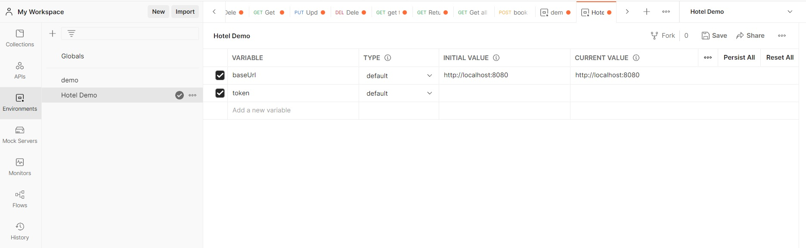
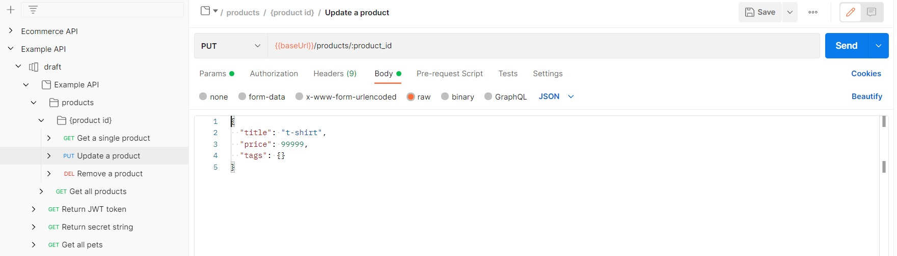

# Python Openapi Specifications

This is a collection of example apis based on the OpenApi 3.0 specification which can be run on the local server and tested with the help of Postman as described below.

## Table of contents
  - [Installation](#installation)
    - [*Step 1: Install Python*](#step-1-install-python)
    - [*Step 2: Install Postman*](#step-2-install-postman)
    - [*Step 3: Download the files*](#step-3-download-the-files)
    - [*Step 3: Install required libraries*](#step-3-install-required-libraries)
  - [Usage](#usage)
    - [*Run the local server*](#run-the-local-server)
    - [*Sending api requests via Postman*](#sending-api-requests-via-postman)

## Installation

***

### *Step 1: Install Python*

Download and install python (3.6+) [here](https://www.python.org/downloads/)
***

### *Step 2: Install Postman*

You can download and use postman or use the web version in which case you have to download the postman desktop agent to be able to send api requests to ur local host.<br>
Download and install postman [here](https://www.postman.com/downloads/)
***

### *Step 3: Download the files*

You can either download the files from Github as a zip or clone the repo to ur local machine using -
```
git clone https://github.com/PointSec-io/python-openapi-quickstarts.git
```
***

### *Step 3: Install required libraries*

Install the required libraries using the following command in the cli after traversing to the repo
```
python3 -m pip install -r requirements.txt
```
***

## Usage

### *Run the local server*

Run the file `main.py` or use the following command  to start the local server (It runs on http://127.0.0.1:8080)
```
python3 main.py
```
***

### *Sending api requests via Postman*

1. Open the postman client and import the openapi spec by clicking on File -> import<br>


1. Drag the file or click upload files and select the required yaml file to be imported and click import<br>


3. Create a new environment by clicking create new environment and add two variables <br>
   * `baseUrl` with initial value - `http://localhost:8080`
   * `token`


4. Click on the `Return JWT token` request and under the `Tests` tab, paste the following code as shown below.
   ```
    var jsonData = JSON.parse(responseBody);

    postman.setEnvironmentVariable("token", jsonData.access_token);

   ```


4. Click send to request an access token which will be automatically set as the value of the environment variable `token`

5. To test the api requests that require an access token, you will need to set the token to `{{token}}` under the Authorization tab of the request like shown below.


6. Select the request and press send after assigning values to the path/query variables and/or body variables to get the requested output.


