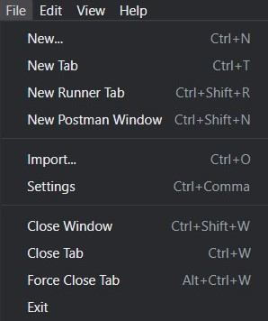
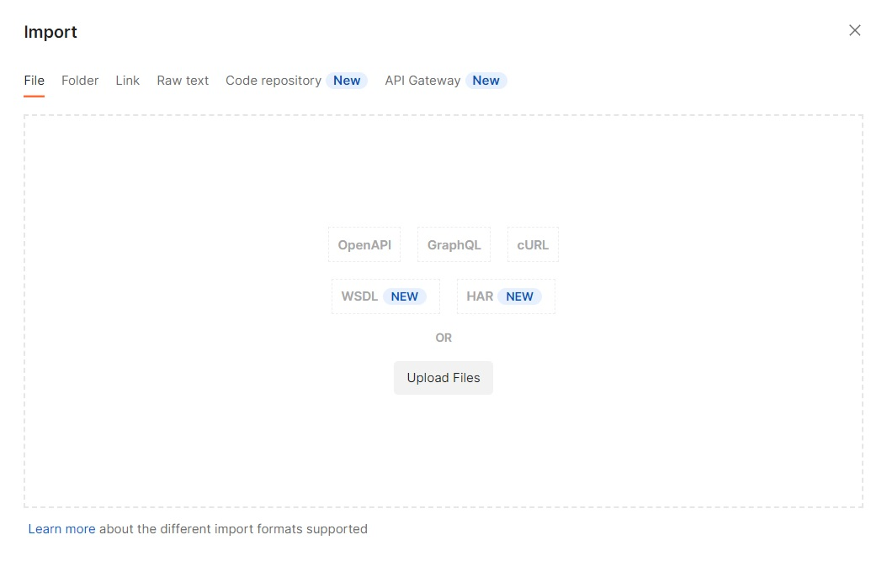
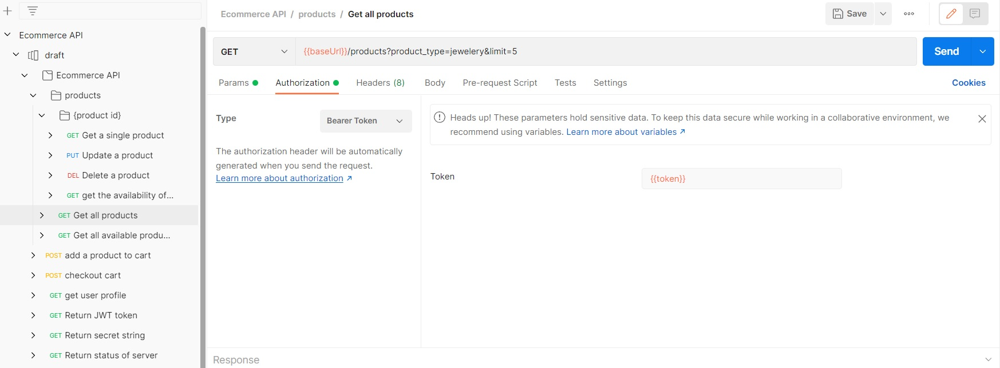
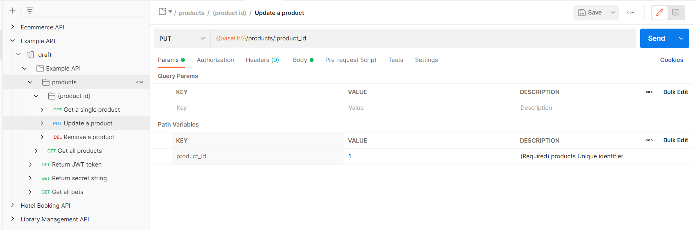
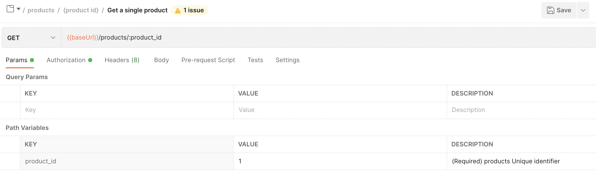
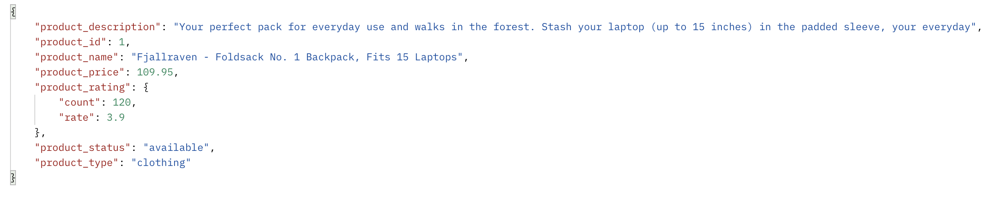
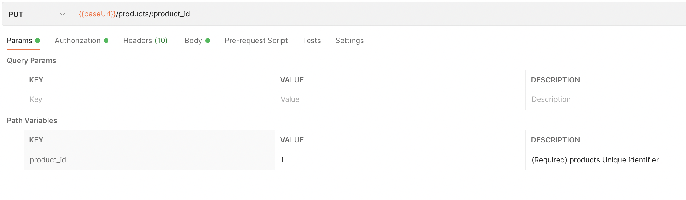
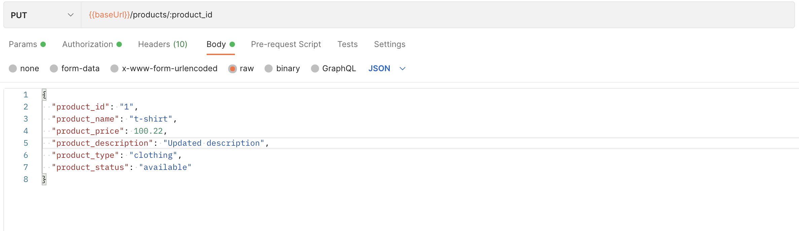
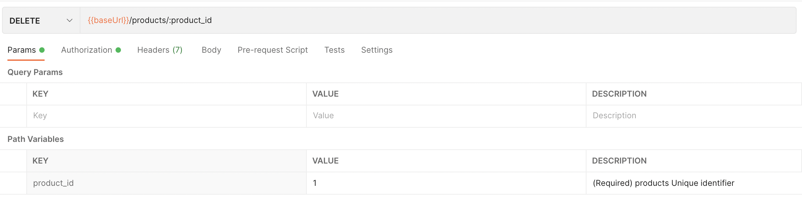
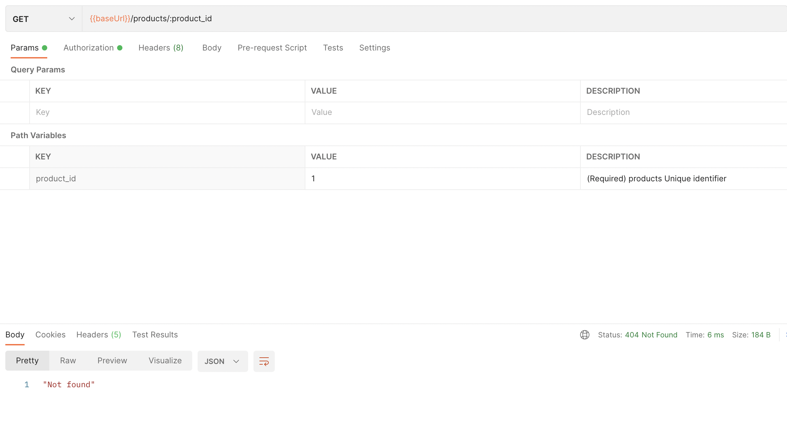

# Example Ecommerce api

This is an example ecommerce api based on the OpenApi 3.0 specification which can be run on the local server and tested with the help of Postman as described below.

  - [What is Firetail?](#what-is-firetail)
  - [Other Examples](#other-examples)
  - [Installation](#installation)
    - [*Step 1: Install Python*](#step-1-install-python)
    - [*Step 2: Install Postman*](#step-2-install-postman)
    - [*Step 3: Download the files*](#step-3-download-the-files)
    - [*Step 4: Install required libraries*](#step-3-install-required-libraries)
  - [Usage](#usage)
    - [*Run the local server*](#run-the-local-server)
    - [*Send api requests via Postman*](#sending-api-requests-via-postman)
  - [Sample cases](#sample-cases)
  
What is Firetail? 
===
Firetail is an open source library that you can incorporate into your api that 
helps secure the endpoints. It also provides authentication and prevents common malicious queries from reaching the endpoint.

For more information, click [here](https://pointsecio.readthedocs.io/en/latest/)


Other Examples
===
[Hotel booking api](../hotel-booking-example/README.MD)<br>
[Library management api](../library-management-example/README.MD)<br>
[Social media api](../social-media-example/README.MD)<br>
[Swagger 2.0 Petstore api](../swagger-petstore-2.0-example/README.MD)<br>
[Swagger 3.0 Petstore api](../swagger-petstore-3.0-example/README.MD)

Installation
===
Steps to run the example from scratch

## *Step 1: Install Python*

Download and install python (3.6+) [here](https://www.python.org/downloads/)


## *Step 2: Install Postman*

You can download and use postman or use the web version in which case you have to download the postman desktop agent to be able to send api requests to your local host.<br>
Download and install postman [here](https://www.postman.com/downloads/)


## *Step 3: Download the example specifications*

You can either download the files from Github as a zip or clone the repo to your local machine using -
```
git clone https://github.com/PointSec-io/python-openapi-quickstarts.git
```


## *Step 4: Install the required libraries*

Move to the ecommerce-example folder and install the required libraries using the following command
```
python3 -m pip install -r requirements.txt
```
***

Usage
===

### *Run the local server*

Run the file `main.py` or use the following command  to start the local server (It runs on http://127.0.0.1:8080)
```
python3 main.py
```
***

### *Send api requests via Postman*

1. Open the postman client and import the openapi spec by clicking on File -> import
    >

2. Drag the file or click upload files and select the required yaml file to be imported and click import
    >

3. Create a new environment by clicking create new environment and add two variables
    >`baseUrl` with initial value - `http://localhost:8080`<br>
    >`token`
    >

4. Click on the `Return JWT token` request and under the `Tests` tab, paste the following code as shown below.
    ```
    var jsonData = JSON.parse(responseBody);

    postman.setEnvironmentVariable("token", jsonData.access_token);

   ```
    >
   

5. Click send to request an access token which will be automatically set as the value of the environment variable `token`

6. To test the api requests that require an access token, you will need to set the token to `{{token}}` under the Authorization tab of the request like shown below.
    >

7. Select the request and press send after assigning values to the path/query variables and/or body variables to get the requested output.
    >
    >

***
Sample cases
===
>*Here are some examples of sending requests to the endpoints with some sample data.<br>All the sample cases assume that you have done the above steps to initialize the authorization token for the endpoints that may need them and that you are running the related example as a local server.<br>
If you want to undo the changes you have made, just restart the local server.*
## *Get product*
1. Click on the "Get a single product" endpoint and give 1 as the input value for the product_id as shown below and click send.
    >
2. At the bottom under "Body", you will see the following output if everything was done correctly.
    >

## *Update product*
1. Click on the "Update a product" endpoint and give 1 as the input value for the product_id as shown below.
    >
2. Click on the Body tab and then enter the details to be updated as shown below and then click send.
    >
3. You can check the updated details by using the get product endpoint as shown in the first sample case.

## *Delete product*
1. Click on the "Delete a product" endpoint.Give 1 as the input value for the product_id as shown below and then click send.
    >
2. You can check if the deletion was successful by using the get a product endpoint. If the result says "Not found", the deletion was a success.
    >