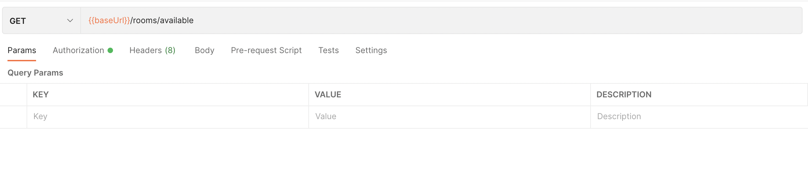
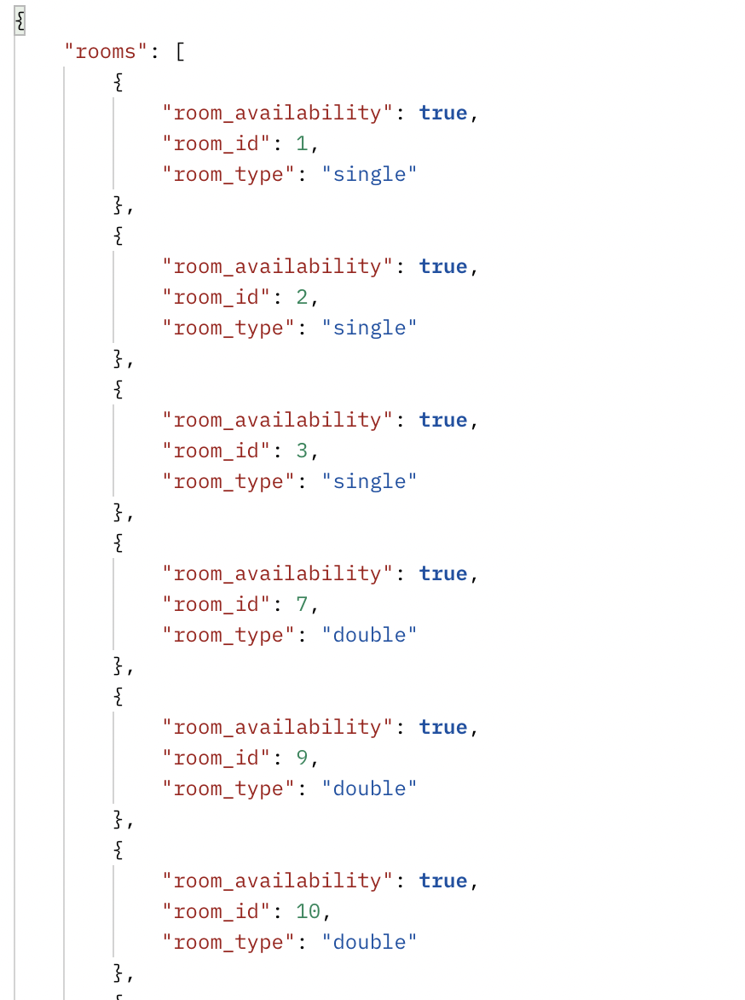
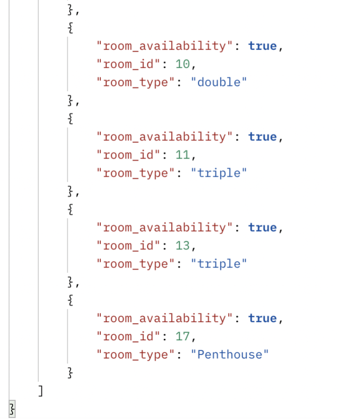
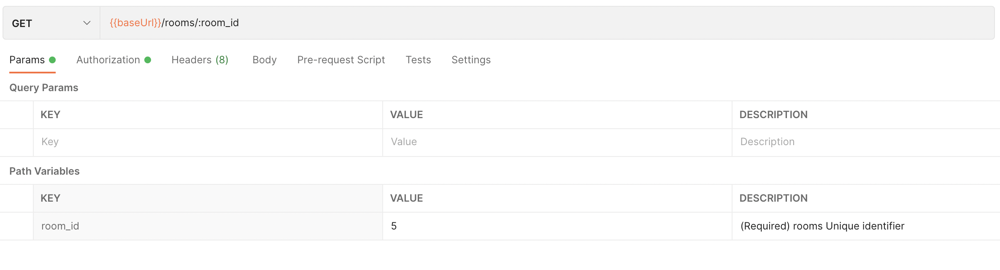
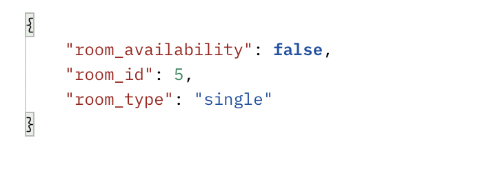
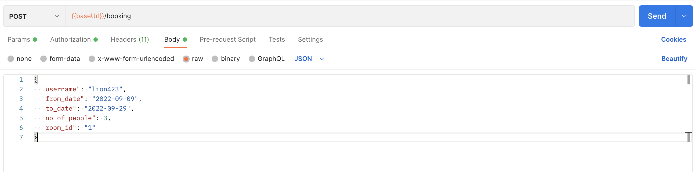
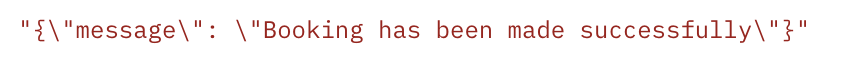
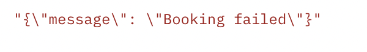

# Example Ecommerce api

This is an example hotel booking api based on the OpenApi 3.0 specification which can be run on the local server and tested with the help of Postman as described below.

  - [What is Firetail?](#what-is-firetail)
  - [Other Examples](#other-examples)
  - [Installation](#installation)
    - [*Step 1: Install Python*](#step-1-install-python)
    - [*Step 2: Download the files*](#step-2-download-the-files)
    - [*Step 3: Install Postman*](#step-3-install-postman)
    - [*Step 4: Install required libraries*](#step-4-install-required-libraries)
  - [Usage](#usage)
    - [*Run the local server*](#run-the-local-server)
    - [*Send api requests via Postman*](#sending-api-requests-via-postman)
  - [Sample cases](#sample-cases)
  
What is Firetail? 
===
Firetail is an open source library that you can incorporate into your api that 
helps secure the endpoints. It also provides authentication and prevents common malicious queries from reaching the endpoint.

For more information, click [here](https://firetail.readthedocs.io/en/latest/)


Other Examples
===
[Ecommerce api](../ecommerce-example/README.MD)<br>
[Library management api](../library-management-example/README.MD)<br>
[Social media api](../social-media-example/README.MD)<br>
[Swagger 2.0 Petstore api](../swagger-petstore-2.0-example/README.MD)<br>
[Swagger 3.0 Petstore api](../swagger-petstore-3.0-example/README.MD)

## Installation

***

### *Step 1: Install Python*

Download and install python (3.6+) [here](https://www.python.org/downloads/)
***

### *Step 2: Download the files*

You can either download the files from Github as a zip or clone the repo to your local machine using -
```
git clone https://github.com/FireTail-io/python-openapi-quickstarts.git
```
***

### *Step 3: Install Postman*

1. You can download and use postman or use the web version in which case you have to download the postman desktop agent to be able to send api requests to your local host.<br>
Download and install postman [here](https://www.postman.com/downloads/)

2. Open the postman client and import the postman imports by clicking on File -> import<br>


3. Click on folder, choose "postman_import" folder and click open<br>


4. Click import with the selected files <br>

<br>

***

### *Step 4: Install required libraries*

Install the required libraries using the following command in the cli in the downloaded location.
```
python3 -m pip install -r requirements.txt
```
***

## Usage

### *Run the local server*

Run the file `main.py` or use the following command  to start the local server (It runs on http://127.0.0.1:8080)
```
python3 main.py
```
***

### *Sending api requests via Postman*

> **_NOTE:_** Call the endpoint called 'RETURN JWT TOKEN' to generate and set an authorization token which will allow access to the other endpoints. If the token expires, simply call the endpoint again.
<br>

Once you have the local server running, you can now send requests via postman. 
* Click on collection on the left and then select the request that you would like to send. Then fill in the parameters and body as required.

* Click send and the response will be displayed as shown.


Sample cases
===
>*Here are some examples of sending requests to the endpoints with some sample data.<br>All the sample cases assume that you have done the above steps to initialize the authorization token for the endpoints that may need them and that you are running the related example as a local server.<br>
If you want to undo the changes you have made, just restart the local server.*

## *Get all available rooms*
1. Click on the "Get all available rooms" endpoint under the Hotel Booking Api, and then click send.
    >
2. You will get all the rooms with room_availaiblity=True as the result.
    >
    >

## *Get a room*
1. Click on the "Get a room" endpoint and input 5 as the value for the room_id as shown below. Click send.
    >
2. You should get the following output.
    >

## *Book a room*
1. Click on the "Book a room" endpoint and input details in the body as shown below. Click send.
    >
2. You should either get a booking confirmation or booking fail. You can send the request multiple times with the same details and check for both responses.
    >
    >